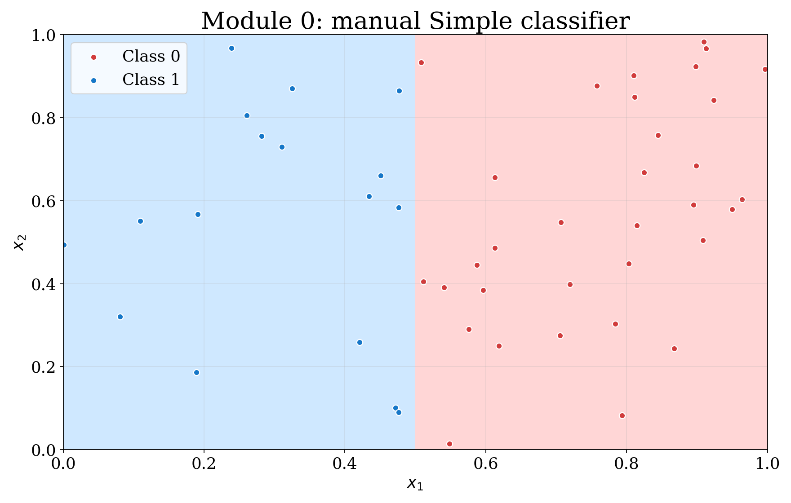
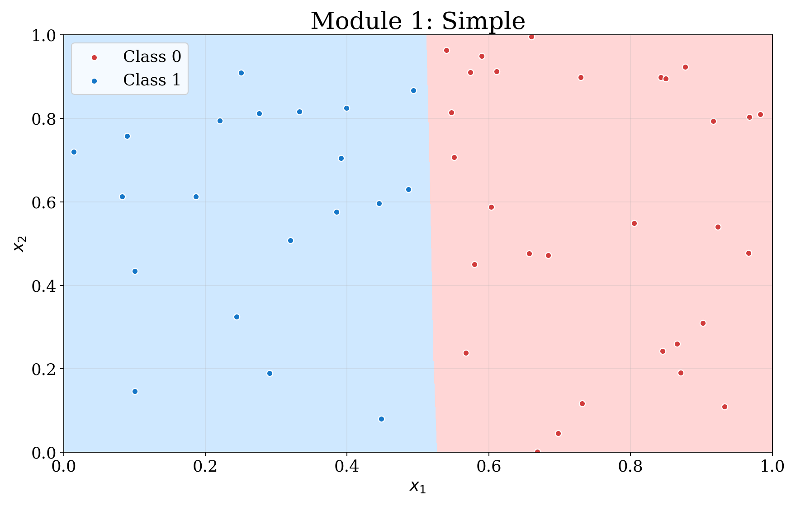
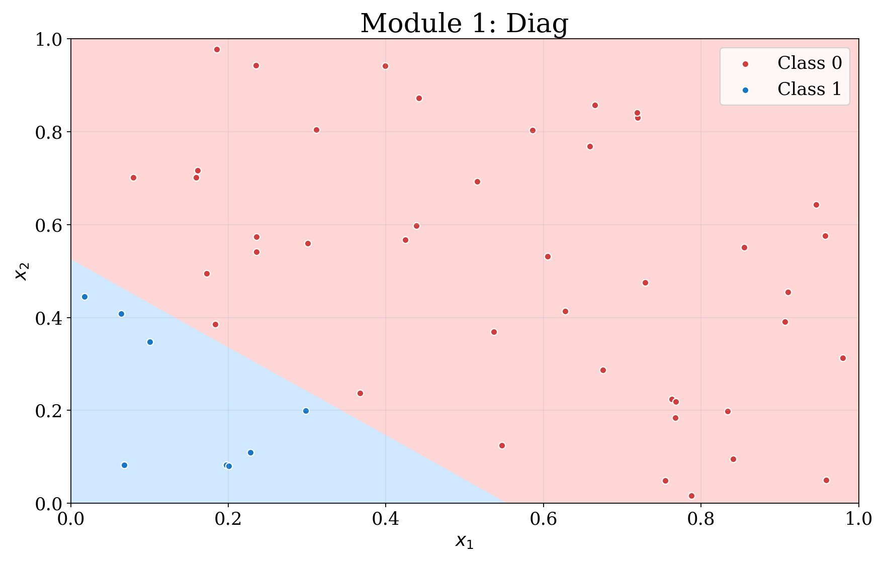
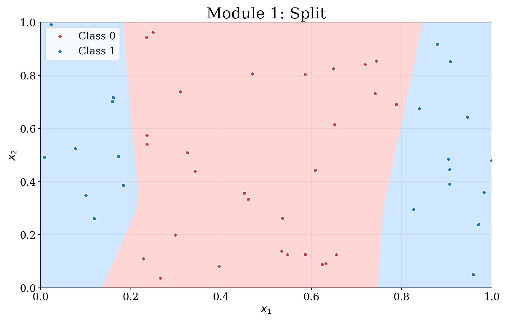
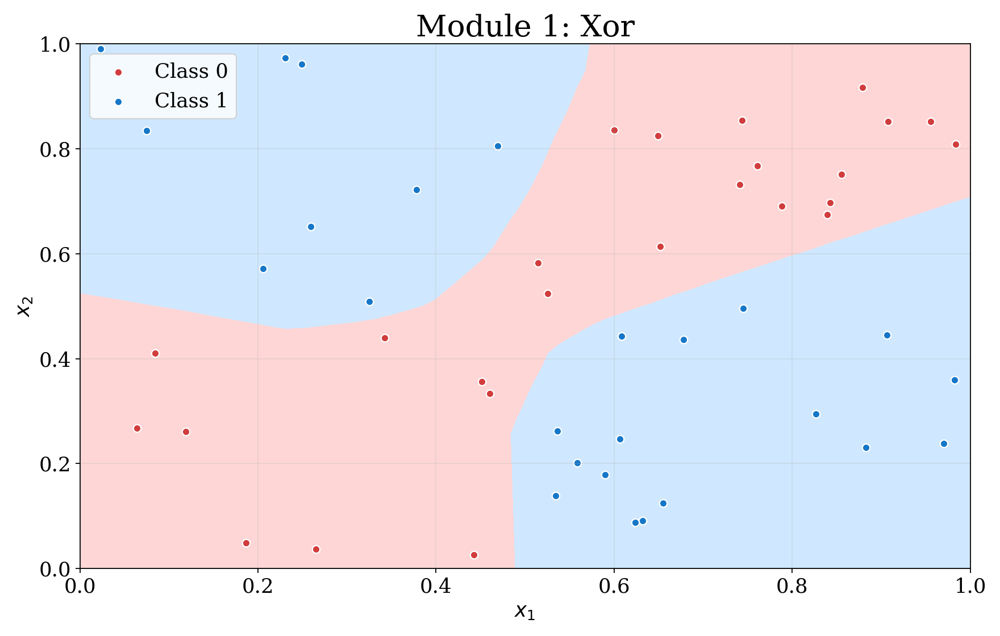
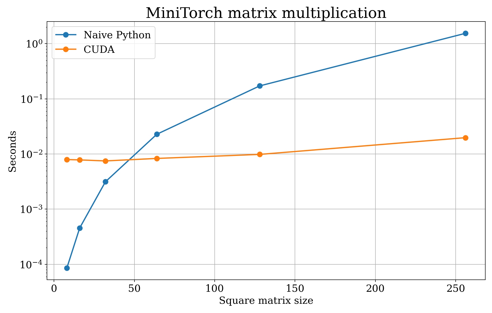

# Домашнее задание 1 — MiniTorch

Выполнены Modules 0–3.

## Module 0 — Fundamentals

В Task 0.5 требовалось вручную подобрать классификатор для датасета Simple.
Использованы параметры `w1 = -20`, `w2 = 0`, `bias = 10`:

```text
prediction = sigmoid(-20 * x1 + 0 * x2 + 10)
```

При пороге `prediction = 0.5` граница решений проходит по `x1 = 0.5`.



## Module 1 — Autodifferentiation

Параметры обучения: 50 точек, learning rate 0.5, 500 эпох.

| Датасет | Hidden | Итоговый loss | Correct |
| --- | ---: | ---: | ---: |
| Simple | 2 | 0.865623 | 50/50 |
| Diag | 4 | 0.294166 | 50/50 |
| Split | 8 | 1.088532 | 50/50 |
| Xor | 10 | 0.556849 | 50/50 |

### Логи обучения

```text
Simple: epoch=50, loss=26.199269, correct=38/50
Simple: epoch=100, loss=13.547386, correct=46/50
Simple: epoch=150, loss=8.839342, correct=47/50
Simple: epoch=200, loss=5.521613, correct=49/50
Simple: epoch=250, loss=3.831709, correct=50/50
Simple: epoch=300, loss=3.296726, correct=50/50
Simple: epoch=350, loss=2.818813, correct=50/50
Simple: epoch=400, loss=2.519020, correct=50/50
Simple: epoch=450, loss=2.203017, correct=50/50
Simple: epoch=500, loss=0.865623, correct=50/50

Diag: epoch=50, loss=3.459962, correct=50/50
Diag: epoch=100, loss=1.797790, correct=50/50
Diag: epoch=150, loss=1.275000, correct=50/50
Diag: epoch=200, loss=0.976389, correct=50/50
Diag: epoch=250, loss=0.769237, correct=50/50
Diag: epoch=300, loss=0.616718, correct=50/50
Diag: epoch=350, loss=0.501868, correct=50/50
Diag: epoch=400, loss=0.414337, correct=50/50
Diag: epoch=450, loss=0.346845, correct=50/50
Diag: epoch=500, loss=0.294166, correct=50/50

Split: epoch=50, loss=23.806757, correct=43/50
Split: epoch=100, loss=21.863390, correct=38/50
Split: epoch=150, loss=17.748233, correct=41/50
Split: epoch=200, loss=13.262812, correct=41/50
Split: epoch=250, loss=7.105189, correct=47/50
Split: epoch=300, loss=8.299857, correct=46/50
Split: epoch=350, loss=2.611817, correct=50/50
Split: epoch=400, loss=3.007849, correct=50/50
Split: epoch=450, loss=1.535002, correct=50/50
Split: epoch=500, loss=1.088532, correct=50/50

Xor: epoch=50, loss=24.497310, correct=40/50
Xor: epoch=100, loss=16.470524, correct=43/50
Xor: epoch=150, loss=9.924681, correct=48/50
Xor: epoch=200, loss=5.806729, correct=50/50
Xor: epoch=250, loss=2.992347, correct=50/50
Xor: epoch=300, loss=1.766512, correct=50/50
Xor: epoch=350, loss=1.201739, correct=50/50
Xor: epoch=400, loss=0.887744, correct=50/50
Xor: epoch=450, loss=0.690311, correct=50/50
Xor: epoch=500, loss=0.556849, correct=50/50
```

### Результаты

#### Simple



#### Diag



#### Split



#### Xor



## Module 2 — Tensors

Параметры обучения: 50 точек, learning rate 0.5, 500 эпох.

| Датасет | Hidden | Итоговый loss | Correct | Секунд на эпоху |
| --- | ---: | ---: | ---: | ---: |
| Simple | 2 | 0.739093 | 50/50 | 0.0673 |
| Diag | 4 | 0.219508 | 50/50 | 0.1493 |
| Split | 8 | 1.442352 | 50/50 | 0.4031 |
| Xor | 10 | 0.696331 | 50/50 | 0.5739 |

## Module 3 — Efficiency

### Parallel diagnostics

```text
MAP: loops #0 and #1; parallel structure is optimal; allocations hoisted.
ZIP: loops #2 and #3; parallel structure is optimal; allocations hoisted.
REDUCE: loop #4; parallel structure is optimal; allocation hoisted.
MATRIX MULTIPLY: loop #5; parallel structure is optimal; no allocation hoisting.
```

### CUDA

На Tesla T4 пройдены все CUDA-тесты:

```text
Task 3.3: 57 passed
Task 3.4: 7 passed
```

Сравнение CUDA matrix multiplication с наивной реализацией на CPU:

| Размер | Naive Python, с | CUDA, с | Ускорение |
| ---: | ---: | ---: | ---: |
| 8 | 0.000086 | 0.007939 | 0.0x |
| 16 | 0.000456 | 0.007818 | 0.1x |
| 32 | 0.003136 | 0.007495 | 0.4x |
| 64 | 0.022828 | 0.008317 | 2.7x |
| 128 | 0.171762 | 0.009841 | 17.5x |
| 256 | 1.541241 | 0.019779 | 77.9x |



### Обучение

Параметры обучения: 50 точек, 10 hidden units, learning rate 0.05,
500 эпох.

| Датасет | CPU loss | CPU correct | CPU, с/эпоху | GPU loss | GPU correct | GPU, с/эпоху |
| --- | ---: | ---: | ---: | ---: | ---: | ---: |
| Simple | 0.223369 | 50/50 | 0.0674 | 0.223369 | 50/50 | 1.8706 |
| Diag | 0.005888 | 50/50 | 0.0510 | 0.005888 | 50/50 | 1.8544 |
| Split | 0.218559 | 50/50 | 0.0515 | 0.218559 | 50/50 | 1.8429 |
| Xor | 0.776544 | 50/50 | 0.0502 | 0.776544 | 50/50 | 1.8358 |

Большая модель: Split, 100 hidden units, learning rate 0.05, 500 эпох.

| Backend | Итоговый loss | Correct | Секунд на эпоху |
| --- | ---: | ---: | ---: |
| CPU | 0.134727 | 50/50 | 0.0792 |
| GPU | 0.134727 | 50/50 | 1.8730 |
